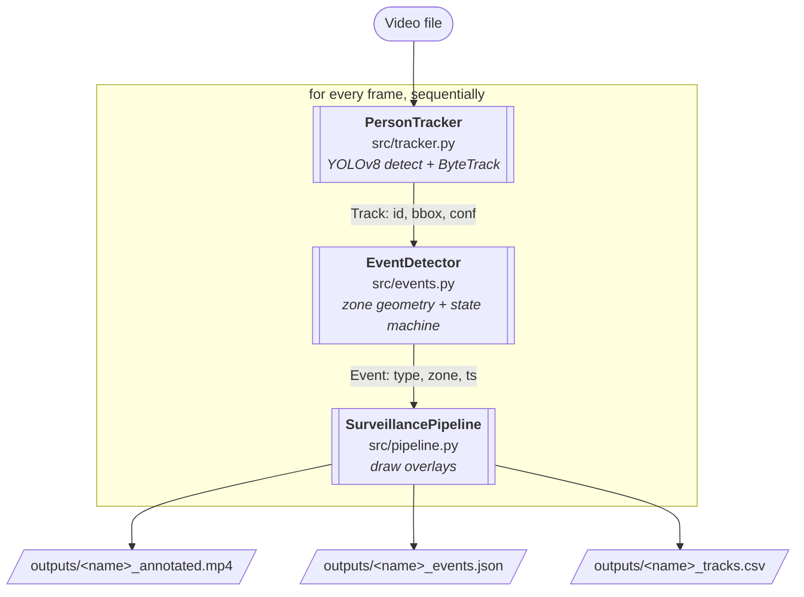
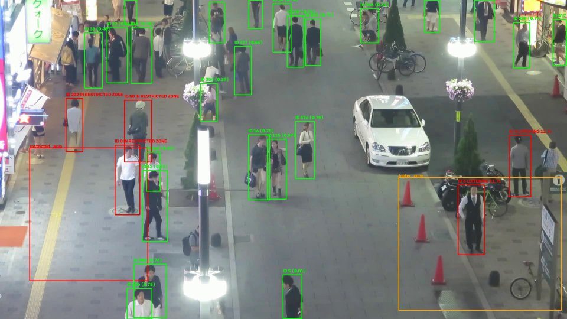
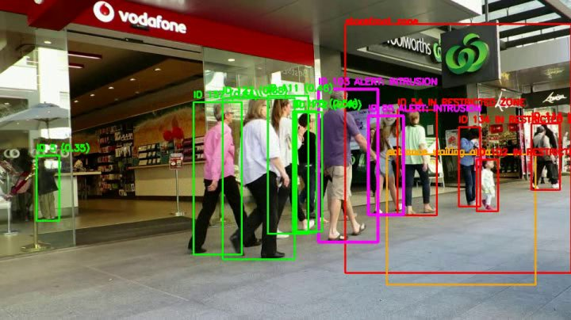
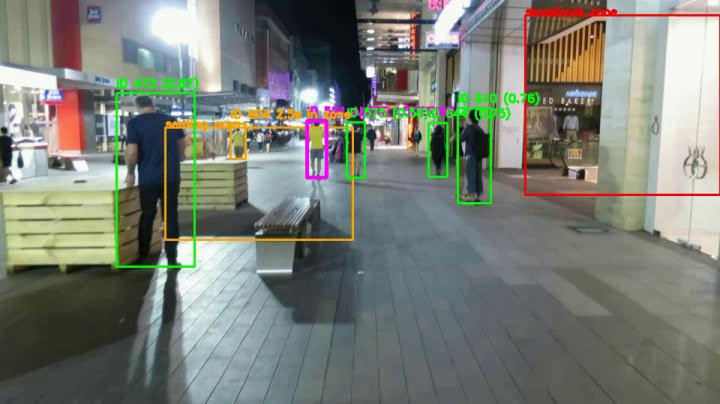
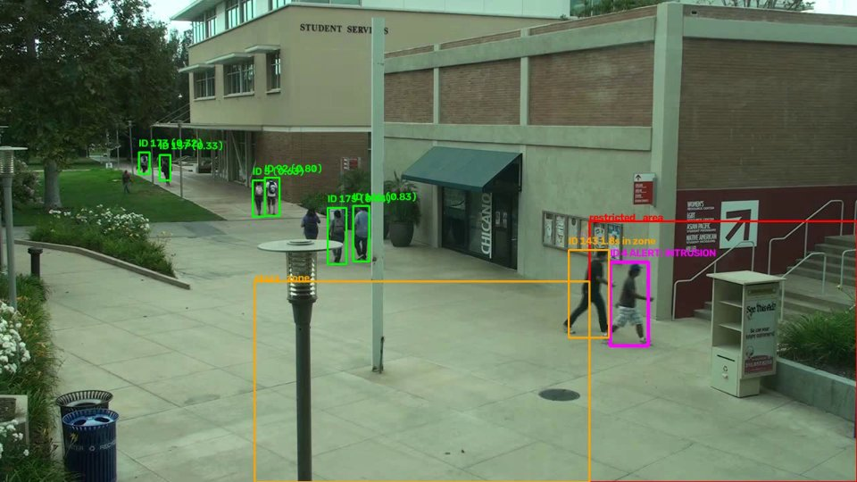
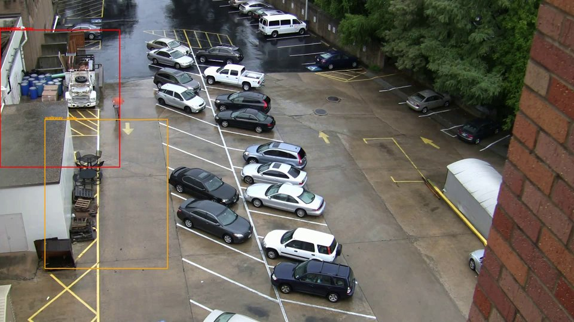

# Video Surveillance: Detection, Tracking & Event Recognition

A prototype pipeline that detects people in security-camera footage, tracks them across
frames with persistent IDs, and raises zone-based events (intrusion, loitering).

## Architecture



- **`src/tracker.py`** — wraps a YOLOv8 detector + ByteTrack (via Ultralytics' built-in
  `model.track()`). Frame in, list of `Track(track_id, bbox, confidence)` out. Owns the
  only ultralytics-specific code the tracker needs.
- **`src/events.py`** — pure zone/state logic, no CV dependencies beyond Shapely for
  point-in-polygon. Loads zones from JSON, keeps a per-`(track_id, zone)` state machine for
  entry time and de-duplicated alerts, and exposes both `update()` (new events, for the log)
  and `get_status()` (live per-frame zone occupancy, for drawing).
- **`src/pipeline.py`** — orchestrates one video end-to-end: reads frames, calls the
  tracker and event detector, draws overlays, and streams all three output files to disk.
- **`src/detector.py`** — a plain YOLOv8 detector (no tracking) kept as a minimal building
  block / for detector-only experimentation; not used by the main pipeline, which needs
  the tracker's persistent IDs.
- **`src/evaluate.py`** — standalone MOTA/MOTP evaluation against MOT17 ground truth.
- **`run.py`** — CLI entrypoint.

Each stage only depends on plain dataclasses (`Track`, `Event`, `Zone`) from the stage
before it, not on ultralytics/shapely internals, so the detector, tracker, or event logic
can be swapped independently.

**Frame handling:** frames are processed synchronously, one at a time, streamed straight
to `cv2.VideoWriter` and the CSV/JSON writers rather than buffered — memory use stays flat
regardless of video length. There's no batching across frames because `model.track()`
needs sequential frames to maintain tracker state; batching would only help pure detection.

## Model choices

**Detector: YOLOv8n (nano).** Chosen over Faster R-CNN for the speed/accuracy trade-off
on CPU-bound, unpaid-for-GPU deployment: YOLOv8 is a single-stage detector that's an order
of magnitude faster than two-stage detectors like Faster R-CNN at a modest accuracy cost,
and ships pretrained on COCO (`person` is class 0) so no fine-tuning is needed to satisfy
the assignment's "use existing models" guidance. `yolov8s.pt` / `yolov8m.pt` are drop-in
via `--model` for more accuracy at lower FPS — worth it if a GPU is available.

**Tracker: ByteTrack** (Ultralytics' built-in `bytetrack.yaml`), not DeepSORT. ByteTrack
associates *every* detection (not just high-confidence ones) with existing tracks via
motion/IoU, which is specifically what keeps an ID alive through brief occlusion without
needing an appearance embedding — cheaper than DeepSORT's re-ID network and, per the
ByteTrack paper, competitive with or better than embedding-based trackers on crowded
pedestrian benchmarks (MOT17 included). `botsort.yaml` (`--tracker botsort.yaml`) is a
drop-in alternative that adds an appearance embedding on top of the same IoU logic — better
at re-identifying someone after a *long* absence (e.g. leaving frame and re-entering
later), at extra compute cost per frame. Neither approach is true long-term re-ID (see
Limitations).

**Zone geometry: Shapely.** Point-in-polygon via `Polygon.contains()` instead of hand-rolled
ray casting — correct on concave/complex polygons for free, and the zones config can stay
plain arbitrary-vertex polygons rather than axis-aligned boxes.

## A bug fixed during development: confidence threshold vs. ByteTrack

The tracker was originally passing its single `conf_threshold` (0.4) straight into YOLO's
detector *before* ByteTrack saw anything. ByteTrack is a **two-stage** associator — by
design it matches high-score boxes first, then tries to recover tracks by matching
remaining tracks against low-score boxes down to `track_low_thresh` (0.1 in
`bytetrack.yaml`). Filtering at 0.4 upstream of the tracker meant that recovery stage never
received anything to work with, so a person who was briefly occluded or motion-blurred
(scoring, say, 0.2) would get dropped and re-spawned as a new ID instead of recovered — a
direct cause of missed detections and fragmented tracks on crowded footage.

Fix (`src/tracker.py`): the detector is now always fed down to `_ASSOC_CONF_FLOOR = 0.1`
(matching ByteTrack's own low threshold) so the tracker's recovery stage works as designed;
`conf_threshold` (default lowered from 0.4 to 0.25, matching YOLO's and ByteTrack's own
defaults) is applied only as a post-filter on what gets *reported*. This is transparent to
callers — same `Track` objects out — but changes what the tracker sees internally.

Measured effect on MOT17-04 (976 frames, CPU, `yolov8n`, ByteTrack):

| config | MOTA | MOTP | switches | false positives | misses |
|---|---|---|---|---|---|
| before fix (conf=0.4, filtered pre-tracker) | 0.282 | 0.175 | 55 | 1026 | 33065 |
| after fix (conf=0.25, imgsz=640) | 0.316 | 0.185 | 87 | 2281 | 30156 |
| after fix + `--imgsz 960` | **0.394** | 0.186 | 168 | 3306 | 25326 |

`imgsz` turned out to be the bigger lever for *this specific clip*: MOT17-04 is
1920×1080 with ~50 people per frame (one of the densest sequences in MOT17), and YOLO's
default 640 inference size shrinks a distant person to a handful of pixels before the
detector ever sees them. Raising `imgsz` (see `--imgsz` on `run.py` / `evaluate.py`,
default left at 640) recovers many of those at a real CPU cost — see Performance notes.
Switches and false positives both rise alongside the fix because more of the crowd is now
being detected and tracked at all — on a scene this dense, a certain amount of that trade
is expected (see Limitations).

### Does the fix generalize, or was MOT17-04 a special case?

MOT17-04 is the densest, hardest sequence in MOT17 — a single data point there doesn't say
much about typical footage. With the fix in place (same code, same `conf=0.25`,
`imgsz=640` — no per-sequence tuning), here's every MOT17 training sequence tested:

| sequence | scene | avg. people/frame | MOTA | MOTP |
|---|---|---|---|---|
| MOT17-09 | daylight, moderate crowd | 10.1 | **0.458** | 0.197 |
| MOT17-04 | daylight, very dense crowd | 48.7 | 0.316 (0.394 at `imgsz=960`) | 0.185 |
| MOT17-10 | **night**, moderate-dense crowd | 19.6 | 0.310 | 0.239 |

Two things stand out:

- **Crowd density alone accounts for most of the MOT17-04 gap** — a typical daylight scene
  (MOT17-09, 10 people/frame) scores 0.458, well above MOT17-04's 0.316 at the same
  settings, confirming density (not some other property of that clip) is the driver.
- **Low light hurts about as much as extreme crowding does.** MOT17-10 is a *night* scene
  with less than half the crowd density of MOT17-04, yet scores about the same (0.310 vs
  0.316) — worse than MOT17-09 despite being less crowded than MOT17-04. Unlike crowd
  density, this doesn't have an easy knob: raising `imgsz` helps by giving small/distant
  people more pixels, but it doesn't fix low contrast or motion blur in dark footage, so I'd
  expect little gain from applying the same fix there (not verified — didn't have time to
  test it).

## Setup

```bash
python -m venv venv
venv\Scripts\activate            # Windows; use `source venv/bin/activate` on Linux/Mac
pip install -r requirements.txt
```

Requires Python 3.11. `ultralytics` will auto-download `yolov8n.pt` on first use if it
isn't already present in the working directory.

`data/videos/` and `data/virat/` (bundled) hold the 5 sample input clips. The *raw* MOT17
image-sequence + `gt.txt` dataset used only by `evaluate.py` (~200MB per sequence) is **not**
bundled — see the assignment's dataset list to download it if you want to reproduce the
MOTA/MOTP numbers below. `outputs/` ships with sample results already produced against the
bundled clips for the current code.

## Usage

```bash
python run.py --video data/videos/MOT17-04.mp4 --zones config/zones_mot17.json --output outputs/
```

The 5 bundled clips, each runnable the same way:

| video | zones config | scene |
|---|---|---|
| `data/videos/MOT17-04.mp4` | `config/zones_mot17.json` | very dense daylight crowd |
| `data/videos/MOT17-09.mp4` | `config/zones_mot17-09.json` | moderate daylight crowd |
| `data/videos/MOT17-10.mp4` | `config/zones_mot17-10.json` | night, moderate-dense crowd |
| `data/virat/VIRAT_clip1.mp4` | `config/zones_virat1.json` | campus plaza |
| `data/virat/VIRAT_clip2.mp4` | `config/zones_virat2.json` | parking lot |

Options:

| flag | default | meaning |
|---|---|---|
| `--video` | required | input video file |
| `--zones` | required | zones config (see below) |
| `--output` | `outputs/` | output directory |
| `--model` | `yolov8n.pt` | YOLO weights (`yolov8n/s/m.pt` — n=fastest, m=most accurate) |
| `--conf` | `0.25` | min. confidence for a *reported* track (tracker still associates lower-confidence detections internally — see above) |
| `--imgsz` | `640` | inference resolution; raise to 960-1280 for high-res/crowded scenes |
| `--device` | `cpu` | `cpu` or `cuda` |
| `--tracker` | `bytetrack.yaml` | `bytetrack.yaml` (fast) or `botsort.yaml` (appearance re-ID, slower) |

Evaluation against MOT-format ground truth:

```bash
python -m src.evaluate --video data/MOT17/train/MOT17-04-FRCNN/img1 \
                        --gt data/MOT17/train/MOT17-04-FRCNN/gt/gt.txt \
                        --imgsz 960 --num_frames 200   # --num_frames optional, for a quick check
```

Swap in any other downloaded MOT17 sequence's `img1`/`gt.txt` path to evaluate it — that's
how the MOT17-09 and MOT17-10 rows in the results table below were produced.

## Configuration (zones.json)

```json
{
  "zones": [
    {
      "name": "restricted_area",
      "type": "intrusion",
      "polygon": [[100, 500], [500, 500], [500, 950], [100, 950]]
    },
    {
      "name": "lobby_zone",
      "type": "loitering",
      "polygon": [[1350, 600], [1900, 600], [1900, 1050], [1350, 1050]],
      "loiter_threshold_seconds": 5
    }
  ]
}
```

- `polygon` — pixel-space `[x, y]` vertices in the source video's native resolution, any
  number of points, need not be axis-aligned.
- `type` — `"intrusion"` (fires once per zone entry) or `"loitering"` (fires once the
  track has been continuously inside the zone for `loiter_threshold_seconds`).
- A person's zone membership is tested at their bounding box's **bottom-center** point
  (feet position), not the box centroid — the correct proxy for "which zone is this person
  standing in" for a person who's only partly inside a zone's boundary.
- Per-`(track, zone, event_type)` alerting is de-duplicated: an intrusion only re-fires
  after the track has left and re-entered the zone; a loitering timer resets on exit.

## Outputs

For `<name>.mp4`, running the pipeline produces:

- `<name>_annotated.mp4` — original video with boxes, track IDs, zone outlines, and
  live status labels (normal / in restricted zone / loitering Ns / flashing alert on the
  frame an event fires) drawn on every frame.
- `<name>_events.json` — one entry per **new** event: `frame_number`, `timestamp`,
  `track_id`, `bbox`, `event_type`, `zone_name`, `confidence`.
- `<name>_tracks.csv` — every reported box on every frame: `frame, timestamp, track_id,
  x1, y1, x2, y2, confidence`. This is the raw per-frame detection/tracking output; the
  events log only captures zone-triggered moments, not the full track history.

Sample results for the bundled clips are already in `outputs/`.

## Sample results

**MOT17-04** (crowded street scene) — tracked IDs, a live intrusion box (red), and an
active loitering alert (red zone, "LOITERING 11.4s") in the bottom-right zone:



**MOT17-09** (moderate daylight crowd) — multiple people crossing `storefront_zone`
trigger intrusion alerts (red boxes, magenta "ALERT: INTRUSION" flash) as they walk past:



**MOT17-10** (night scene) — tracking and zone overlays still work in low light; a
magenta loitering flash fires in the `seating_area` zone by the bench:



**VIRAT clip 1** (campus plaza) — a magenta flash marks the exact frame an intrusion
event fires into `restricted_area`:



**VIRAT clip 2** (parking lot) — sparser scene; zone outlines shown, with a small,
distant intrusion detection near the loading dock (red box, upper left) — a realistic
example of the low-confidence, small-object detections discussed under Limitations:



**Note:** The raw input and annotated output videos (`data/`, `outputs/`) didn't upload successfully to this repo — screenshots are included instead (see `docs/`) as evidence of the pipeline's output. I'm still trying to get the videos uploaded; if they don't appear here, I'm happy to share them separately (e.g. via email or a file-sharing link) on request.

## Beyond the core requirements

From the assignment's "nice to have" list:

- **FPS benchmarks** — above
- **Configurable alert thresholds & de-duplication** — loiter thresholds in
  `zones.json`, per-track/zone/event-type alert dedup in `src/events.py`
- **Ground-truth evaluation (MOTA/MOTP)** — `src/evaluate.py`, tested across 3 MOT17
  sequences spanning crowd density and lighting

## Performance notes

Measured on: CPU only (no CUDA available in this environment), `yolov8n.pt`, ByteTrack,
MOT17-04 frames (1920×1080), 100-frame sample.

| `imgsz` | throughput (CPU) |
|---|---|
| 640 (default) | ~7.4 fps |
| 960 | ~3.7 fps |
| 1280 | ~1.5 fps |

Sparser/lower-resolution scenes run faster: the full `run.py` pipeline (detection +
tracking + zone logic + drawing + video/CSV/JSON writing, not just raw inference) hit
**5.2 fps** end-to-end on VIRAT clip 1 (1280×720, `imgsz=640`, run in isolation). The
`outputs/` MOT17-04 and VIRAT clip 2 runs shown in Sample results were regenerated
concurrently with each other for expedience and landed at 2.3 and 3.5 fps respectively —
CPU-contended, not a clean per-clip number; expect closer to the isolated figures above
when run one at a time.

A GPU (`--device cuda`) would remove inference as the bottleneck entirely; not available
to verify in this environment. Memory stays flat over long videos since frames, tracks,
and CSV/JSON rows are streamed to disk rather than buffered (see Architecture).

## Known limitations

- **Not true long-term re-identification.** ByteTrack (default) re-associates through
  brief occlusion via motion/IoU only; it has no appearance memory, so a person who leaves
  the frame for more than `track_buffer` (30 frames, ~1s at 30fps) and re-enters will get a
  new ID. `--tracker botsort.yaml` adds an appearance embedding and does noticeably better
  across longer gaps, but is still not robust to a full change of viewpoint or a long
  absence, and costs extra compute per frame.
- **Dense-crowd recall vs. ID switches is a trade-off, not a solved problem.** On very
  crowded, high-resolution scenes (MOT17-04: ~50 people/frame at 1920×1080), small,
  overlapping, or motion-blurred people are still missed even after the `imgsz` fix
  (MOTA 0.39 on this clip), and detecting more of the crowd gives ByteTrack more chances to
  swap IDs between two people who cross paths — both show up in the metrics table above.
  A stronger re-ID model or a larger detector would push both further, at real speed cost.
- **Lighting/camera shake** aren't handled explicitly (no histogram equalization, no frame
  stabilization) — relies entirely on YOLOv8's native robustness. This is measurable, not
  theoretical: MOT17-10 (night) scores about the same MOTA as MOT17-04 (daylight, 2.5x the
  crowd density) — see the sequence comparison above. Camera shake wasn't measured directly
  (no shaky-camera sequence in the clips tested).


## What I'd improve with more time

- Fine-tune YOLOv8 on a pedestrian-surveillance dataset (VisDrone/VIRAT) instead of relying
  on stock COCO weights — COCO's `person` class skews towards closer, more frontal people
  than typical CCTV footage.
- Add a `--num_frames`-style batched/async video reader so decode and inference overlap.
- An evaluation pass on UCF-Crime-style footage (the assignment's "real-world messiness"
  tip) wasn't done — MOT17 (3 sequences, clean ground truth) and VIRAT were used instead.
- Test whether a higher `imgsz` helps the low-light case (MOT17-10) the way it did the
  dense-crowd case (MOT17-04) — my guess above is that it won't help much, but it's a guess.
